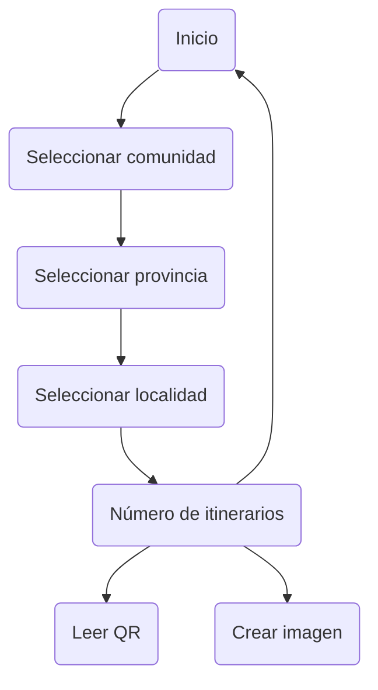

# consumo_API
Para el bootcamp "Consumo de una API"

El cliente nos está requiriendo crear una página para reflejar la información almacenada en una API

Desarrollador web y web móvil

<a href="https://github.com/public-apis/public-apis">Respositorio de API's</a>

<h3>Contexto del proyecto:</h3>

    - Desarrollar una página web con HTML, CSS, Javascript
    - Consumir una API externa
    - Mostrar los datos en tarjetas, tablas, etc
    - Estar documentada con su respectivo README
    - Utilizar Bootstrap o una librería de diseño

<h3>Extra:</h3>

    - La sección está hecha con paginación<
    - Ver el detalles de un solo elemento
    - Filtrar la información traída por la API
    - Hacer Deploy en Github
    - Consumir N APIs
    - Crear un Json y consumir la información
    - Validar con alguna función de Javascript el funcionamiento de la página (test)
    - Consumir una API securizada (usuario y contraseña y token)

<h3>Entregables</h3>

    - Figma (opcional)
    - Link de github
    - En caso de hacerlo, enviar el Link del Deploy

 
<h3>Solución:</h3>

Desarrollar una solución/herrameienta en la que podamos ser guiados en una ruta de visita por las distintas capitales de provincia y sus comunidades, usaremos:
- Tres archivos JSON:
  - Comunidades autonomas: lista de comunidades
  - Provincias: lista de provincias
  - Poblaciones: lista de poblaciones
- chat GPT: para la selección de los lugares
- Google Maps

Un UML de actividad básico sería:

Tambien como solución para ver detalles, tras mostrar por pantalla la ruta con los lugares elegidos, se generará un ccódigo QR el cual enlazara con la app de Google Maps de nuestro SmartPhone.
Tambien el resultado se podra descargar como imagen independiente con la lista de lugares, código qr y ruta en el mapa de Google.
Para la creación del QR y de la imagen, se usan las librerias de JS
    
- QRCode.js
- html2canvas.js

<a href="https://juancmacias.github.io/consumo_API/">Despliege de la solución</a>

Here is a simple flow chart:

